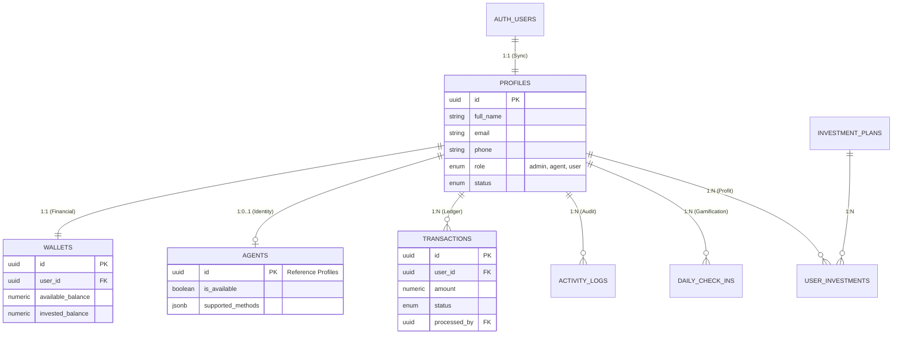

# 🏗️ هيكلية قاعدة بيانات كاسبي (Kasby Database Architecture)

## الإصدار: V4.0 (Unified SSOT)

هذا المستند يوضح كيف ترتبط الجداول ببعضها البعض وكيف تتدفق البيانات بين تطبيق الأدمن وتطبيق المستخدم.

---

### 📊 المخطط البصري للعلاقات (ER Diagram)

---

### 🔗 شرح روابط الربط الأساسية (Core Links)

#### 1. الركن الأساسي:Profiles ↔️ Auth

- **نوع الربط**: 1 إلى 1 (واحد لواحد).
- **الوصف**: كل مستخدم يسجل في سوبابيز (`auth.users`) يتم إنشاء "ملف شخصي" له تلقائياً في جدول `profiles`. هذا الجدول هو **المصدر الوحيد للحقيقة (SSOT)** لاسم المستخدم، بريده، ورتبته (`role`).

#### 2. المحرك المالي: Profiles ↔️ Wallets

- **نوع الربط**: 1 إلى 1.
- **الوصف**: بمجرد إنشاء الملف الشخصي، يتم ربطه بمحفظة مالية فريدة. لا يمكن لأي مستخدم أن يملك أكثر من محفظة، ولا يمكن للمحفظة أن تتبع لأكثر من مستخدم.

#### 3. سجل العمليات: Profiles ↔️ Transactions

- **نوع الربط**: 1 إلى متعدد (1:N).
- **الوصف**: كل عملية شحن أو سحب يتم تسجيلها برقم المستخدم (`user_id`). كما يتم ربط العمليات التي يوافق عليها المدير بمعرف المدير نفسه (`processed_by`).

#### 4. تفعيل الوكلاء: Profiles ↔️ Agents

- **نوع الربط**: 1 إلى (0 أو 1).
- **الوصف**: ليس كل مستخدم وكيلًا. إذا تم ترقية المستخدم لرتبة `agent` في جدول `profiles` وتفعيل حسابه، تظهر بياناته التقنية (مثل طرق الدفع المتاحة) في جدول `agents`. الجميل هنا أننا **لا نكرر** اسمه أو هاتفه، بل نأخذهم من جدول `profiles` مباشرة.

#### 5. الاستثمارات: Plans ↔️ User Investments

- **نوع الربط**: 1 إلى متعدد.
- **الوصف**: يتم ربط كل استثمار يقوم به المستخدم بخطة محددة من `investment_plans` وبملفه الشخصي.

---

### 🛠️ مميزات هذا الربط

1. **عدم التكرار**: إذا غير المستخدم اسمه، يتغير في حساب الأدمن وتطبيق المستخدم وفي سجلات العمليات فوراً (لأن الكل يقرأ من جدول واحد).
2. **الأمان**: لا يمكن حذف مستخدم وترك محفظته أو عملياته "معلقة"؛ النظام يمنع ذلك بروابط `Foreign Keys` صارمة.
3. **السرعة**: الربط عبر الـ `UUID` يجعل البحث عن بيانات المستخدم فائق السرعة حتى مع ملايين العمليات.

> [!TIP]
> جميع هذه الروابط مدمجة برمجياً داخل ملف `KASBY_MASTER_PRODUCTION_V4.sql` عبر أوامر `REFERENCES`.
