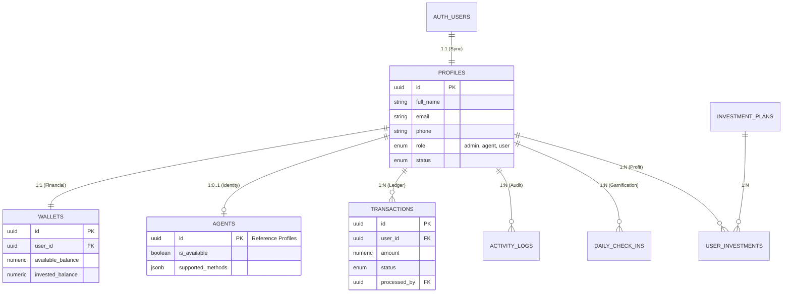

# 🏗️ دليل الواجهة الخلفية الكامل - كاسبي (Kasby Backend Master Guide)

## الإصدار: V4.0 (Unified SSOT)

هذا المستند هو المرجع الشامل والوحيد لكل ما يخص "الباكيند" وقاعدة البيانات. يجمع بين شرح العلاقات البرمجية والأكواد الفعلية للجداول.

---

## 1️⃣ المخطط البصري للعلاقات (ER Diagram)

هذا المخطط يوضح كيف ترتبط الجداول ببعضها البعض وكيف تتدفق البيانات بين تطبيق الأدمن وتطبيق المستخدم.



---

## 2️⃣ شرح روابط الربط الأساسية (Core Links)

### 🔗 الركن الأساسي: Profiles ↔️ Auth

- **الوصف**: كل مستخدم يسجل في سوبابيز يتم إنشاء "ملف شخصي" له تلقائياً في جدول `profiles`. هذا الجدول هو **المصدر الوحيد للحقيقة (SSOT)**.

### 💰 المحرك المالي: Profiles ↔️ Wallets

- **الوصف**: ربط 1 إلى 1. كل مستخدم يملك محفظة مالية فريدة (`user_id`).

### 📝 سجل العمليات: Profiles ↔️ Transactions

- **الوصف**: ربط 1 إلى متعدد. كل عملية (`deposit`, `withdrawal`) مسجلة تحت معرف المستخدم وتخضع لرقابة المدير.

### 🤝 تفعيل الوكلاء: Profiles ↔️ Agents

- **الوصف**: الوكلاء هم مستخدمون ببيانات تقنية إضافية، ولكن اسمهم وهواتفهم تأتي من `profiles` دون تكرار.

---

## 3️⃣ الكود الفعلي للجداول (SQL Tables Schema)

هذا الكود يمثل الهيكل الحقيقي الموجود في سوبابيز مع جميع القيود (Constraints):

```sql
-- ============================================================
-- 1. IDENTITY & PROFILES (الجداول الرئيسية)
-- ============================================================
CREATE TABLE IF NOT EXISTS public.profiles (
    id              UUID PRIMARY KEY REFERENCES auth.users(id) ON DELETE CASCADE,
    full_name       TEXT NOT NULL DEFAULT '',
    email           TEXT UNIQUE NOT NULL,
    phone           TEXT UNIQUE,
    role            role_type DEFAULT 'user',
    status          user_status DEFAULT 'active',
    account_tier    account_tier DEFAULT 'free',
    kyc_status      kyc_status DEFAULT 'unverified',
    avatar_url      TEXT,
    country_code    TEXT,
    province        TEXT DEFAULT '',
    city            TEXT DEFAULT '',
    address         TEXT DEFAULT '',
    referral_code   TEXT UNIQUE,
    referred_by_id  UUID REFERENCES public.profiles(id) ON DELETE SET NULL,
    last_login_at   TIMESTAMPTZ,
    created_at      TIMESTAMPTZ DEFAULT NOW(),
    updated_at      TIMESTAMPTZ DEFAULT NOW()
);

-- ============================================================
-- 2. FINANCIAL CORE (المحافظ والعمليات)
-- ============================================================
CREATE TABLE IF NOT EXISTS public.wallets (
    id                  UUID PRIMARY KEY DEFAULT uuid_generate_v4(),
    user_id             UUID UNIQUE NOT NULL REFERENCES public.profiles(id) ON DELETE CASCADE,
    available_balance   NUMERIC(18, 4) NOT NULL DEFAULT 0.00 CHECK (available_balance >= 0),
    invested_balance    NUMERIC(18, 4) NOT NULL DEFAULT 0.00 CHECK (invested_balance >= 0),
    profit_balance      NUMERIC(18, 4) NOT NULL DEFAULT 0.00 CHECK (profit_balance >= 0),
    currency            TEXT NOT NULL DEFAULT 'USD',
    is_frozen           BOOLEAN DEFAULT FALSE,
    created_at          TIMESTAMPTZ DEFAULT NOW(),
    updated_at          TIMESTAMPTZ DEFAULT NOW()
);

CREATE TABLE IF NOT EXISTS public.transactions (
    id              UUID PRIMARY KEY DEFAULT uuid_generate_v4(),
    user_id         UUID NOT NULL REFERENCES public.profiles(id) ON DELETE RESTRICT,
    type            txn_type NOT NULL,
    amount          NUMERIC(18, 4) NOT NULL CHECK (amount > 0),
    status          txn_status DEFAULT 'pending',
    running_balance NUMERIC(18, 4),
    description     TEXT,
    proof_url       TEXT,
    rejection_reason TEXT,
    processed_by    UUID REFERENCES auth.users(id),
    processed_at    TIMESTAMPTZ,
    created_at      TIMESTAMPTZ DEFAULT NOW(),
    updated_at      TIMESTAMPTZ DEFAULT NOW()
);

-- ============================================================
-- 3. AGENTS (الوكلاء)
-- ============================================================
CREATE TABLE IF NOT EXISTS public.agents (
    id                  UUID PRIMARY KEY REFERENCES public.profiles(id) ON DELETE CASCADE,
    is_available        BOOLEAN DEFAULT TRUE,
    supported_methods   JSONB DEFAULT '[]',
    success_rate        NUMERIC(5, 2) DEFAULT 100.00,
    total_txns          INTEGER DEFAULT 0,
    created_at          TIMESTAMPTZ DEFAULT NOW(),
    updated_at          TIMESTAMPTZ DEFAULT NOW()
);

-- ============================================================
-- 4. LOGS & AUDIT (السجلات والرقابة)
-- ============================================================
CREATE TABLE IF NOT EXISTS public.activity_logs (
    id              UUID PRIMARY KEY DEFAULT uuid_generate_v4(),
    actor_id        UUID REFERENCES auth.users(id) ON DELETE SET NULL,
    actor_role      role_type,
    action          TEXT NOT NULL,
    entity_type     TEXT,
    entity_id       TEXT,
    details         JSONB DEFAULT '{}'::jsonb,
    severity        severity_type DEFAULT 'info',
    ip_address      TEXT,
    created_at      TIMESTAMPTZ DEFAULT NOW()
);
```

---

## 4️⃣ مميزات معمارية SSOT الموحدة

1. **عدم التكرار**: البيانات الشخصية (الاسم، الهاتف) تُعدل في مكان واحد وتظهر للجميع.
2. **الأمان المدمج**: علاقات الـ `Foreign Keys` تضمن عدم فقدان البيانات المالية.
3. **سرعة التطوير**: المبرمج يتعامل مع جداول واضحة ومحددة الوظائف.

> [!IMPORTANT]
> هذا الدليل هو المرجع النهائي لبرمجة الربط مع فلاتر. جميع الاستعلامات يجب أن تستخدم الـ `JOIN` مع جدول `profiles` لجلب بيانات الأسماء.
