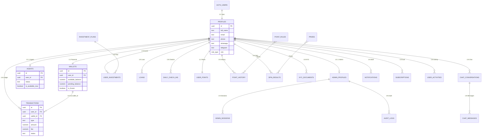

# 🏗️ دليل الواجهة الخلفية الكامل - كاسبي V5.0

## Kasby Backend Master Guide (30 Tables + 1 View)

---

## 1️⃣ المخطط البصري الكامل (ER Diagram)

---

## 2️⃣ تصنيف الجداول حسب الوظيفة

### 🔵 الهوية والملفات (Identity)

| الجدول | الوصف | يستخدمه |
|--------|-------|---------|
| `profiles` | SSOT للمستخدمين | Both |
| `admin_profiles` | بيانات الأدمن الإضافية | Admin |
| `admin_sessions` | جلسات تسجيل الدخول | Admin |

### 💰 النظام المالي (Financial)

| الجدول | الوصف | يستخدمه |
|--------|-------|---------|
| `wallets` | المحافظ المالية | Both |
| `transactions` | سجل العمليات | Both |
| `fees` | الرسوم والعمولات | Both |
| `transaction_limits` | حدود العمليات | Both |
| `currencies` | العملات وأسعار الصرف | Both |

### 📈 الاستثمارات والقروض

| الجدول | الوصف | يستخدمه |
|--------|-------|---------|
| `investment_plans` | خطط الاستثمار | Both |
| `user_investments` | استثمارات المستخدمين | Both |
| `loans` | القروض | Both |

### 🎮 النقاط والمكافآت (Gamification)

| الجدول | الوصف | يستخدمه |
|--------|-------|---------|
| `daily_check_ins` | الحضور اليومي | User |
| `user_points` | رصيد النقاط | Both |
| `point_history` | تاريخ النقاط | User |
| `point_rules` | قواعد النقاط | Admin |
| `prizes` | جوائز العجلة | Both |
| `rewards` | المكافآت | User |
| `spin_results` | نتائج اللفات | User |

### 💬 التواصل (Communication)

| الجدول | الوصف | يستخدمه |
|--------|-------|---------|
| `chat_conversations` | المحادثات | Both |
| `chat_messages` | الرسائل | Both |
| `notifications` | الإشعارات | Both |

### 📋 السجلات (Logging)

| الجدول | الوصف | يستخدمه |
|--------|-------|---------|
| `activity_logs` | سجل نشاط موحد | Both |
| `audit_logs` | سجل عمليات الأدمن | Admin |
| `user_activities` | نشاطات المستخدم | User |

### ⚙️ النظام والمحتوى (System)

| الجدول | الوصف | يستخدمه |
|--------|-------|---------|
| `system_settings` | إعدادات النظام | Admin |
| `countries` | الدول | Both |
| `faqs` | الأسئلة الشائعة | Both |
| `terms_sections` | الشروط والأحكام | Both |
| `kyc_documents` | وثائق التحقق | Both |
| `subscriptions` | الاشتراكات | Both |

---

## 3️⃣ العلاقات الأساسية

### profiles → wallets (1:1)

كل مستخدم = محفظة واحدة. يتم إنشاؤها تلقائياً عند التسجيل.

### profiles → agents (1:0..1)

ليس كل مستخدم وكيلاً. بيانات الوكيل التقنية فقط في `agents`، الاسم والهاتف من `profiles` عبر JOIN.

### profiles → transactions (1:N)

كل عملية مربوطة بـ `user_id` + `wallet_id`. العمليات المعتمدة مربوطة بـ `processed_by` (ID الأدمن).

### transactions → wallets (N:1)

كل عملية مرتبطة بمحفظة محددة عبر `wallet_id`.

> [!IMPORTANT]
> الملف المرجعي النهائي هو `KASBY_MASTER_PRODUCTION_V5.sql` — يحتوي على جميع الـ 30 جدول بأعمدتها الحقيقية.
