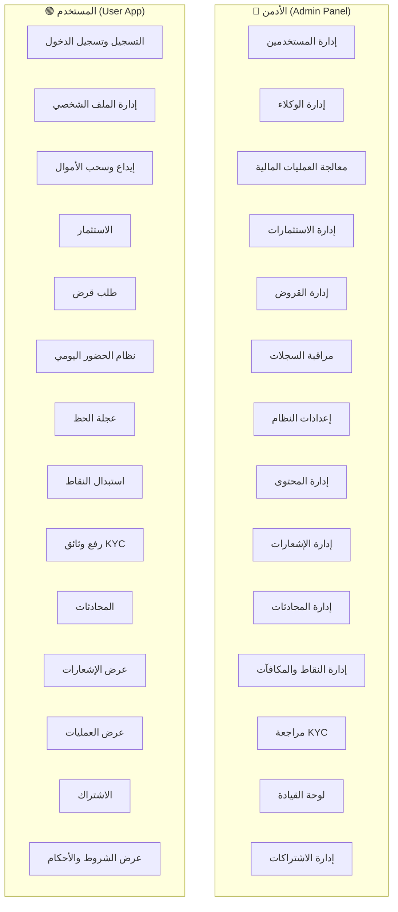
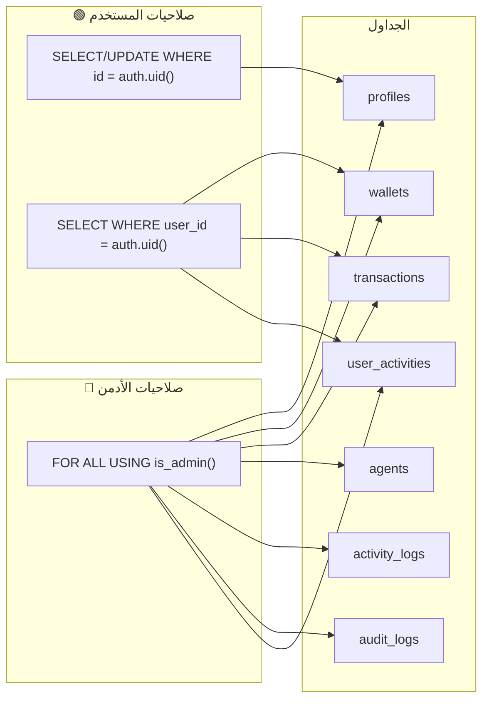
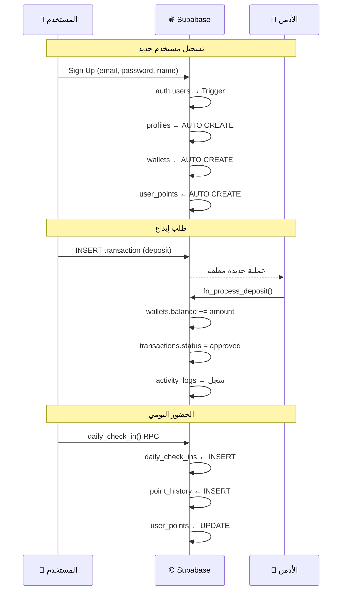

# 📋 حالات الاستخدام والصلاحيات - منصة كاسبي V5.0

## Use Cases & Role Permissions Matrix

---

## 1️⃣ مخطط حالات الاستخدام (Use Case Diagram)

---

## 2️⃣ تفصيل حالات استخدام الأدمن (Admin Use Cases)

### 🔴 A1: إدارة المستخدمين

| العملية | الجدول | الصلاحية |
|---------|--------|----------|
| عرض جميع المستخدمين | `profiles` | SELECT (RLS: is_admin) |
| تعديل حالة المستخدم (حظر/تفعيل) | `profiles.status` | UPDATE |
| ترقية/تخفيض الرتبة | `profiles.role` | UPDATE |
| تغيير مستوى الحساب | `profiles.account_tier` | UPDATE |
| عرض المحفظة المالية | `wallets` | SELECT (RLS: is_admin) |
| تجميد/فك تجميد المحفظة | `wallets.is_frozen` | UPDATE |

### 🔴 A2: إدارة الوكلاء

| العملية | الجدول | الصلاحية |
|---------|--------|----------|
| عرض جميع الوكلاء | `agents` + JOIN `profiles` | SELECT |
| إضافة وكيل جديد | `agents` + `profiles.role='agent'` | INSERT + UPDATE |
| تعديل حالة الوكيل | `agents.status` | UPDATE |
| تعديل طرق الدفع | `agents.supported_methods` | UPDATE |

### 🔴 A3: معالجة العمليات المالية

| العملية | الجدول | الصلاحية |
|---------|--------|----------|
| عرض جميع العمليات | `transactions` | SELECT (RLS: is_admin) |
| الموافقة على إيداع | `transactions` + `wallets` | UPDATE via `fn_process_deposit()` |
| رفض عملية | `transactions.status='rejected'` | UPDATE |
| عرض الرسوم | `fees` | SELECT |
| تعديل الرسوم | `fees` | UPDATE |
| عرض حدود العمليات | `transaction_limits` | SELECT |

### 🔴 A4: إدارة الاستثمارات

| العملية | الجدول | الصلاحية |
|---------|--------|----------|
| إنشاء خطة استثمار | `investment_plans` | INSERT |
| تعديل خطة قائمة | `investment_plans` | UPDATE |
| عرض استثمارات المستخدمين | `user_investments` | SELECT |
| الموافقة على استثمار | `user_investments.approved_by` | UPDATE |

### 🔴 A5: إدارة القروض

| العملية | الجدول | الصلاحية |
|---------|--------|----------|
| عرض جميع القروض | `loans` | SELECT (RLS: is_admin) |
| الموافقة على قرض | `loans.approved_by` | UPDATE |
| تحديث حالة القرض | `loans.status` | UPDATE |

### 🔴 A6: مراقبة السجلات

| العملية | الجدول | الصلاحية |
|---------|--------|----------|
| عرض سجلات الأدمن | `audit_logs` | SELECT |
| عرض سجلات النظام | `activity_logs` | SELECT |
| عرض نشاطات المستخدمين | `user_activities` | SELECT |

### 🔴 A7: إعدادات النظام

| العملية | الجدول | الصلاحية |
|---------|--------|----------|
| إيقاف/تفعيل الإيداعات | `system_settings.pause_deposits` | UPDATE |
| إيقاف/تفعيل السحوبات | `system_settings.pause_withdrawals` | UPDATE |
| وضع الصيانة | `system_settings.is_maintenance_mode` | UPDATE |
| تجميد النظام | `system_settings.system_freeze` | UPDATE |
| إدارة العملات | `currencies` | INSERT/UPDATE |
| إدارة الدول | `countries` | INSERT/UPDATE |

### 🔴 A8-A14: وظائف إضافية

| العملية | الجدول |
|---------|--------|
| إدارة الأسئلة الشائعة | `faqs` |
| إدارة الشروط والأحكام | `terms_sections` |
| إرسال إشعارات | `notifications` |
| إدارة المحادثات والرد | `chat_conversations` + `chat_messages` |
| إدارة قواعد النقاط | `point_rules` |
| إدارة الجوائز | `prizes` + `rewards` |
| مراجعة وثائق KYC | `kyc_documents` |
| إدارة الاشتراكات | `subscriptions` |

---

## 3️⃣ تفصيل حالات استخدام المستخدم (User Use Cases)

### 🟢 U1: التسجيل وتسجيل الدخول

| العملية | الجدول | الصلاحية |
|---------|--------|----------|
| التسجيل | `auth.users` → Trigger → `profiles` + `wallets` + `user_points` | AUTO |
| تسجيل الدخول | `auth.users` | Supabase Auth |
| تحديث آخر دخول | `profiles.last_login_at` | UPDATE (own) |

### 🟢 U2: إدارة الملف الشخصي

| العملية | الجدول | الصلاحية |
|---------|--------|----------|
| عرض ملفي الشخصي | `profiles` | SELECT (RLS: id = auth.uid) |
| تعديل الاسم/الهاتف/العنوان | `profiles` | UPDATE (RLS: id = auth.uid) |
| تعديل الواتساب/تلغرام | `profiles.whatsapp/telegram` | UPDATE (own) |

### 🟢 U3: العمليات المالية

| العملية | الجدول | الصلاحية |
|---------|--------|----------|
| عرض محفظتي | `wallets` | SELECT (RLS: user_id = auth.uid) |
| طلب إيداع | `transactions` (type='deposit') | INSERT (RLS: user_id = auth.uid) |
| طلب سحب | `transactions` (type='withdrawal') | INSERT (RLS: user_id = auth.uid) |
| عرض عملياتي | `transactions` | SELECT (RLS: user_id = auth.uid) |

### 🟢 U4: الاستثمار

| العملية | الجدول | الصلاحية |
|---------|--------|----------|
| عرض خطط الاستثمار | `investment_plans` | SELECT (public) |
| إنشاء استثمار | `user_investments` | INSERT |
| عرض استثماراتي | `user_investments` | SELECT (RLS: user_id = auth.uid) |

### 🟢 U5: القروض

| العملية | الجدول | الصلاحية |
|---------|--------|----------|
| طلب قرض | `loans` | INSERT |
| عرض قروضي | `loans` | SELECT (RLS: user_id = auth.uid) |

### 🟢 U6-U8: النقاط والمكافآت

| العملية | الجدول | الصلاحية |
|---------|--------|----------|
| الحضور اليومي | `daily_check_ins` via `daily_check_in()` | RPC |
| عرض النقاط | `user_points` | SELECT (RLS: user_id = auth.uid) |
| تاريخ النقاط | `point_history` | SELECT (RLS: user_id = auth.uid) |
| لف العجلة | `spin_results` | INSERT |
| استبدال المكافآت | `rewards` → `point_history` | SELECT + INSERT |

### 🟢 U9-U14: وظائف إضافية

| العملية | الجدول |
|---------|--------|
| رفع وثائق KYC | `kyc_documents` (INSERT own) |
| عرض حالة KYC | `kyc_documents` (SELECT own) |
| إرسال رسالة دعم | `chat_messages` (INSERT) |
| عرض محادثاتي | `chat_conversations` (SELECT own) |
| عرض إشعاراتي | `notifications` (SELECT own) |
| الاشتراك في خطة | `subscriptions` (INSERT) |
| عرض الأسئلة الشائعة | `faqs` (SELECT - public) |
| عرض الشروط | `terms_sections` (SELECT - public) |

---

## 4️⃣ مصفوفة الصلاحيات النهائية (Permission Matrix)

| الجدول | Admin | User | Agent | ملاحظات |
|--------|-------|------|-------|---------|
| `profiles` | Full | Own only | Own only | SSOT - المصدر الوحيد |
| `wallets` | Full | View own | ❌ | عبر user_id |
| `transactions` | Full | View+Insert own | ❌ | إيداع/سحب فقط |
| `agents` | Full | ❌ | View own | عبر user_id |
| `activity_logs` | Full | ❌ | ❌ | Admin only |
| `audit_logs` | Full | ❌ | ❌ | Admin only |
| `user_activities` | Full | View own | ❌ | |
| `investment_plans` | Full | View | ❌ | عامة للقراءة |
| `user_investments` | Full | View own | ❌ | |
| `loans` | Full | View own | ❌ | |
| `daily_check_ins` | Full | View+Insert | ❌ | عبر RPC |
| `user_points` | Full | View own | ❌ | |
| `point_history` | Full | View own | ❌ | |
| `kyc_documents` | Full | View+Insert own | ❌ | |
| `chat_conversations` | Full | View own | ❌ | |
| `chat_messages` | Full | View own chats | ❌ | |
| `notifications` | Full | View own | ❌ | |
| `subscriptions` | Full | View own | ❌ | |
| `system_settings` | Full | ❌ | ❌ | Admin only |
| `fees` | Full | View | ❌ | عامة |
| `countries` | Full | View | ❌ | عامة |
| `currencies` | Full | View | ❌ | عامة |
| `faqs` | Full | View | ❌ | عامة |
| `terms_sections` | Full | View | ❌ | عامة |
| `point_rules` | Full | ❌ | ❌ | Admin only |
| `prizes` | Full | View | ❌ | عامة |
| `rewards` | Full | View | ❌ | عامة |
| `spin_results` | Full | View+Insert own | ❌ | |
| `transaction_limits` | Full | View | ❌ | عامة |
| `admin_profiles` | Full | ❌ | ❌ | Admin only |
| `admin_sessions` | Full | ❌ | ❌ | Admin only |

---

## 5️⃣ تدفق البيانات الرئيسي (Data Flow)

---

> [!TIP]
> هذا المستند هو المرجع النهائي لفهم من يفعل ماذا في النظام. استخدمه عند تطوير أي ميزة جديدة لضمان التوافق مع نظام الصلاحيات.
